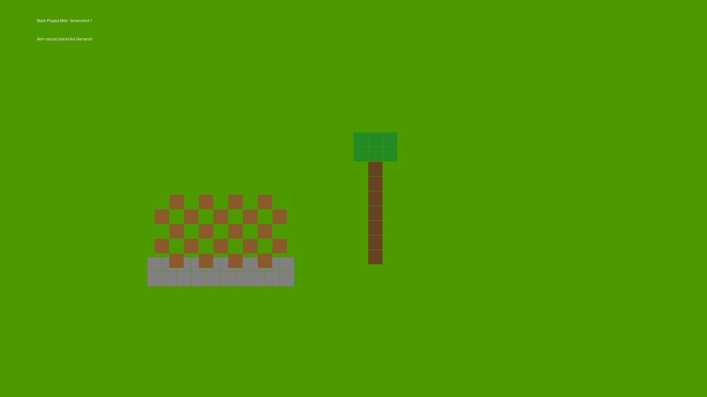
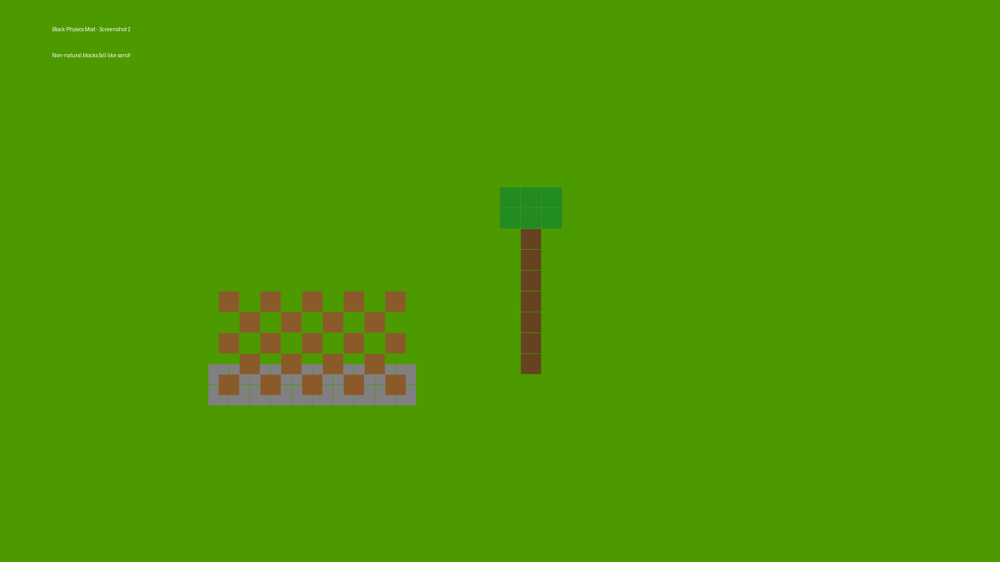
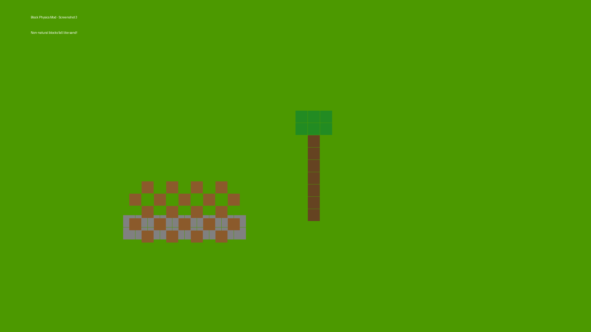

# Block Physics

A Minecraft Fabric mod that makes non-natural blocks obey gravity. When you break a supporting block, all unsupported blocks above it fall down as entities, just like sand and gravel. Trees collapse when you break the bottom log - all logs and leaves above come tumbling down. TNT explosions send blocks flying as falling block entities instead of destroying them.

## Features

- **Realistic Block Physics**: Non-natural blocks (planks, bricks, etc.) fall when unsupported
- **Tree Collapse**: Break the bottom log of a tree and watch it all come down
- **Explosive Physics**: TNT sends blocks flying instead of vaporizing them
- **Structural Blocks**: Stone and cobblestone are exempt - use them for stable foundations

## Screenshots







## Requirements

- Minecraft 1.21.1
- Fabric Loader 0.16.0 or higher
- Fabric API
- Java 21 or higher

## Installation

1. Install [Fabric Loader](https://fabricmc.net/use/installer/) for Minecraft 1.21.1
2. Download and install [Fabric API](https://modrinth.com/mod/fabric-api)
3. Download the mod JAR from the [releases](../../releases) or `build/libs/` folder
4. Place the JAR file in your `.minecraft/mods/` folder
5. Launch Minecraft with the Fabric profile

## Building from Source

```bash
git clone https://github.com/Simplifine-gamedev/block-physics.git
cd block-physics
./gradlew build
```

The compiled JAR will be in `build/libs/`.

## How It Works

The mod listens for block break events and checks if any neighboring blocks have lost their support. Blocks need either a solid block below them or a connection to structural blocks (stone, cobblestone) to stay in place.

For trees, logs need to be connected to the ground through other logs, and leaves need to be within 4 blocks of a supported log.

TNT explosions are intercepted and instead of destroying blocks, they spawn falling block entities with velocity based on the explosion center.

## License

MIT License
